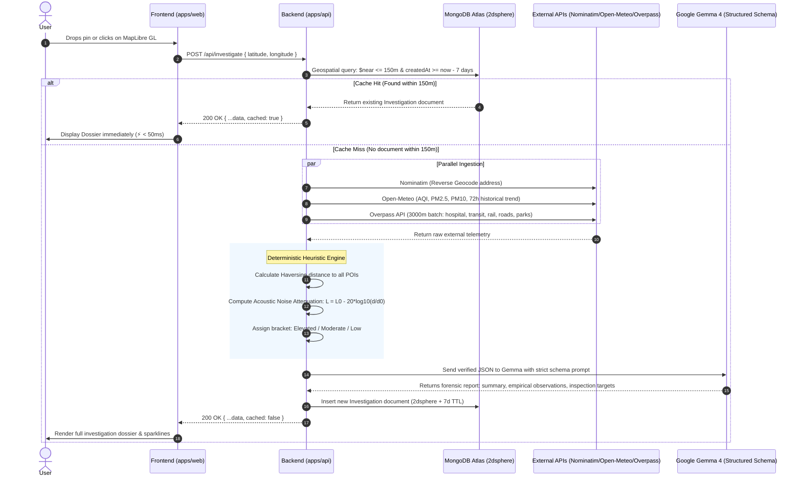

# Zonalyze — System Architecture & Contributor Guide

**Product Name:** Zonalyze  
**Tagline:** Objective Location Intelligence and Grounded Environmental Risk Debriefs  
**Architecture:** Monorepo (`apps/api` for Node/Express/TS, `apps/web` for React/Vite/TS)  
**Cost Model:** ₹0 / Free-tier only (Zero Mapbox keys, open tiles, Open-Meteo, Nominatim, Overpass, MongoDB Atlas M0, Google Gemma AI)

---

## 1. Core System Invariants

1. **No Arbitrary Scores:** Never calculate subjective composite scores (e.g. "Livability: 78/100").
2. **Zero Hallucination Guarantee:** The LLM functions strictly as a forensic analyst inspecting verified JSON data. It never guesses coordinates, distances, or air quality.
3. **Anti-Rate-Limit Cache:** All requests query MongoDB for an investigation within **150 meters** generated in the past **7 days** before hitting external APIs.
4. **Zero-Cost Mapping:** Uses MapLibre GL JS with Carto Voyager vector styles (no Mapbox tokens required).

---

## 2. API Keys & Credentials Required

Zonalyze is intentionally engineered to require **only ONE external API key** and **ONE database connection string**. All geospatial, transit, and weather APIs are 100% keyless.

| Service                | Key / Credential | Required For                                                          | Cost / Tier           | Where to Retrieve                                                         |
| :--------------------- | :--------------- | :-------------------------------------------------------------------- | :-------------------- | :------------------------------------------------------------------------ |
| **Google Gemma 4 API** | `GEMINI_API_KEY` | Backend AI forensic debrief synthesis (`Gemma 4` / Google AI backend) | **Free Tier**         | [Google AI Studio](https://aistudio.google.com/app/apikey)                |
| **MongoDB Atlas**      | `MONGODB_URI`    | Database persistence, 2dsphere caching, 7-day TTL                     | **Free (M0 Sandbox)** | [MongoDB Atlas](https://www.mongodb.com/cloud/atlas)                      |
| **Open-Meteo API**     | _None (Keyless)_ | Real-time & 72h historical PM2.5, PM10, AQI                           | **Free Public API**   | Direct endpoint: `https://air-quality-api.open-meteo.com/v1/air-quality`  |
| **OSM Nominatim**      | _None (Keyless)_ | Reverse geocoding lat/lon to human address                            | **Free Public API**   | Requires custom `User-Agent` header (`Zonalyze-Location-Auditor/1.0`)     |
| **OSM Overpass API**   | _None (Keyless)_ | 3000m batch infrastructure queries                                    | **Free Public API**   | Public interpreter: `https://overpass-api.de/api/interpreter`             |
| **MapLibre Basemaps**  | _None (Keyless)_ | Carto Voyager vector style tiles                                      | **Free Open Style**   | Style URL: `https://basemaps.cartocdn.com/gl/voyager-gl-style/style.json` |

---

## 3. Team Contributor Roles & Ownership Matrix

With 4 contributors on the team, work is divided across clear interface boundaries:

```
+--------------------------------------------------------------------------------------------------+
|                                    TEAM OWNERSHIP MATRIX                                         |
+------------------------------------+-------------------------------------------------------------+
| Role & Contributor                 | Primary Responsibilities & Target Files                     |
+------------------------------------+-------------------------------------------------------------+
| Contributor 1: Backend Lead        | • Orchestration Controller (`apps/api/src/controllers/`)     |
| (You)                              | • Ingestion Services (Nominatim, Open-Meteo, Overpass)      |
|                                    | • Heuristics Engine (Haversine & Noise proxy math)          |
|                                    | • Gemma Structured Output Debrief Integration               |
+------------------------------------+-------------------------------------------------------------+
| Contributor 2: Database Engineer   | • MongoDB Atlas Cluster setup & connection lifecycle         |
|                                    | • Mongoose Schema (`apps/api/src/models/Investigation.ts`)  |
|                                    | • 2dsphere Geospatial Index & 7-Day TTL Index                |
|                                    | • Cache Service (`apps/api/src/services/cache.service.ts`)  |
+------------------------------------+-------------------------------------------------------------+
| Contributor 3: Frontend Map Lead   | • MapLibre GL Integration (`apps/web/src/components/map/`)  |
|                                    | • Carto Voyager Tile styling & responsive map canvas         |
|                                    | • Pin drop, click listener, and address search geocoder     |
|                                    | • Marker pulse animation & location state management        |
+------------------------------------+-------------------------------------------------------------+
| Contributor 4: Frontend UI & Viz   | • Slide-out Dossier Panel (`apps/web/src/components/dossier`)|
|                                    | • Telemetry Radar Scanner loading animation                 |
|                                    | • 72h PM2.5 Sparkline / Trend chart                         |
|                                    | • Acoustic Badge, Infrastructure Grid & Forensic Checklist  |
+------------------------------------+-------------------------------------------------------------+
```

---

## 4. End-to-End System Data Flow



---

## 5. Interface Contracts & Schemas

### 5.1. Client-Server API Contract

**Endpoint:** `POST /api/investigate`  
**Headers:** `Content-Type: application/json`

#### Request Payload:

```json
{
  "latitude": 28.6139,
  "longitude": 77.209
}
```

#### Response Payload (`200 OK`):

```json
{
  "_id": "6701a5b8e9b1a40012345678",
  "cached": false,
  "location": {
    "type": "Point",
    "coordinates": [77.209, 28.6139]
  },
  "address": "Rajpath, Central Secretariat, New Delhi, Delhi, 110001, India",
  "environment": {
    "pm2_5": 84.2,
    "pm10": 162.0,
    "aqi": 182,
    "historical_pm25": [72.1, 75.4, 80.2, 88.0, 84.2]
  },
  "infrastructure": {
    "hospitals": 3,
    "pharmacies": 7,
    "railway_stations": 1,
    "parks": 4,
    "nearest_hospital_dist_m": 820
  },
  "noiseProfile": {
    "estimated_bracket": "Moderate",
    "nearest_source_type": "arterial_road",
    "distance_meters": 185,
    "confidence": "High (geometry verified within 200m)"
  },
  "aiReport": {
    "summary": "Urban arterial corridor with elevated particulate load and moderate daytime acoustic exposure.",
    "empirical_observations": [
      "Nearest primary hospital is located 820 meters away, within standard emergency transit radius.",
      "72-hour air quality exhibits sustained PM2.5 levels exceeding WHO guideline thresholds.",
      "Arterial roadway detected 185 meters from coordinate, producing moderate acoustic proxy attenuation."
    ],
    "site_inspection_targets": [
      "Verify acoustic double-glazing presence on north-facing facades facing the arterial corridor.",
      "Inspect building HVAC intake filters for fine particulate matter accumulation.",
      "Check pedestrian sidewalk continuity toward the nearest transit hub."
    ]
  },
  "createdAt": "2026-10-03T08:15:00.000Z"
}
```

---

### 5.2. Database Schema (`Investigation`)

Implemented in `apps/api/src/models/Investigation.ts`:

- **Geospatial Index:** `InvestigationSchema.index({ location: "2dsphere" })`
- **TTL Index:** `createdAt: { type: Date, default: Date.now, expires: "7d" }`
- **Coordinate Order:** `[longitude, latitude]` (Standard GeoJSON format)

---

### 5.3. Noise Model Formulation

The estimated acoustic proxy uses the distance attenuation law:
$$L = L_0 - 20 \log_{10}\left(\frac{d}{d_0}\right)$$

- **Reference levels:**
  - Railway track: $L_0 = 85 \text{ dBA}$ at $d_0 = 15 \text{ m}$
  - Arterial road: $L_0 = 75 \text{ dBA}$ at $d_0 = 10 \text{ m}$
- **Classification Brackets:**
  - **Elevated:** $L \ge 65 \text{ dBA}$ (or source within $\le 120\text{m}$)
  - **Moderate:** $50 \text{ dBA} \le L < 65 \text{ dBA}$ ($120\text{m} - 450\text{m}$)
  - **Low / Ambient:** $L < 50 \text{ dBA}$ ($> 450\text{m}$)

---

## 6. Monorepo Repository Structure

```
Zonalyze/
├── ARCHITECTURE.md            # System architecture & developer guide (this file)
├── README.md                  # Project overview & quickstart
├── package.json               # Monorepo root workspace
├── tsconfig.base.json         # Shared TypeScript compiler options
│
├── apps/
│   ├── api/                   # BACKEND & DATABASE
│   │   ├── package.json
│   │   ├── tsconfig.json
│   │   ├── .env.example
│   │   └── src/
│   │       ├── index.ts
│   │       ├── config/
│   │       │   └── db.ts             <- Contributor 2 (Database)
│   │       ├── models/
│   │       │   └── Investigation.ts  <- Contributor 2 (Database)
│   │       ├── services/
│   │       │   ├── cache.service.ts      <- Contributor 2 (Database)
│   │       │   ├── nominatim.service.ts  <- Contributor 1 (Backend)
│   │       │   ├── openMeteo.service.ts  <- Contributor 1 (Backend)
│   │       │   ├── overpass.service.ts   <- Contributor 1 (Backend)
│   │       │   ├── heuristic.service.ts  <- Contributor 1 (Backend)
│   │       │   └── gemini.service.ts     <- Contributor 1 (Backend)
│   │       └── controllers/
│   │           └── investigate.controller.ts <- Contributor 1 (Backend)
│   │
│   └── web/                   # FRONTEND & UI
│       ├── package.json
│       ├── tsconfig.json
│       ├── vite.config.ts
│       ├── tailwind.config.js
│       └── src/
│           ├── components/
│           │   ├── map/              <- Contributor 3 (Map & Spatial UI)
│           │   │   ├── MapContainer.tsx
│           │   │   ├── MapMarker.tsx
│           │   │   └── SearchBar.tsx
│           │   └── dossier/          <- Contributor 4 (UI, Viz & Debrief)
│           │       ├── DossierPanel.tsx
│           │       ├── AirQualityCard.tsx
│           │       ├── NoiseCard.tsx
│           │       ├── InfrastructureCard.tsx
│           │       └── ForensicReportCard.tsx
│           └── hooks/
│               └── useInvestigation.ts
```

---

## 7. Local Development Setup

### 7.1. Prerequisites

- **Node.js** v18+ and **npm** v9+ (or pnpm/yarn)
- **MongoDB Atlas** free account or local MongoDB instance

### 7.2. Environment Configuration

Create `apps/api/.env`:

```env
PORT=5000
MONGODB_URI=mongodb+srv://<user>:<password>@cluster0.mongodb.net/zonalyze?retryWrites=true&w=majority
GEMINI_API_KEY=your_gemini_api_key_here
CLIENT_URL=http://localhost:5173
```

Create `apps/web/.env`:

```env
VITE_API_URL=http://localhost:5000/api
```
