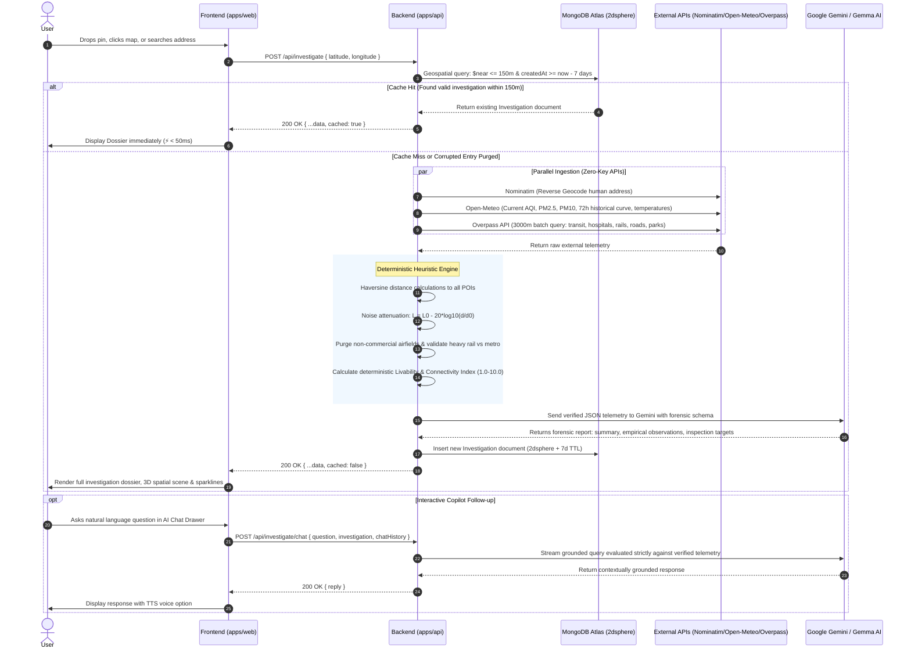

# Zonalyze — System Architecture & Contributor Guide

**Product Name:** Zonalyze  
**Tagline:** Objective Location Intelligence and Grounded Environmental Risk Debriefs  
**Architecture:** Monorepo (`apps/api` for Node/Express/TS, `apps/web` for React/Vite/TS)  
**Cost Model:** ₹0 / Free-tier only (Zero Mapbox keys, Carto Voyager open tiles, Open-Meteo, Nominatim, Overpass, MongoDB Atlas M0 Sandbox, Google Gemini / Gemma AI)

---

## 1. Core System Invariants

1. **Deterministic & Objective Metrics (Zero Arbitrary/Subjective Scores):**
   - The platform never fabricates opaque, black-box composite scores.
   - Any summary metric (e.g. the 1.0–10.0 Livability & Connectivity Index) is mathematically calculated using deterministic weighted formulas grounded in WHO ambient particulate thresholds, inverse-square acoustic attenuation, transit walking isochrones, and emergency healthcare proximity buffers.
2. **Zero Hallucination Guarantee:**
   - The LLM functions strictly as a forensic analyst inspecting verified JSON telemetry.
   - It is strictly prevented from guessing coordinates, estimating physical distances, or inventing air quality readings.
3. **Anti-Rate-Limit Geospatial Cache:**
   - All spatial requests query MongoDB for an existing investigation within **150 meters** conducted in the past **7 days** before querying external upstream APIs.
   - Corrupted or stale entries (e.g. non-commercial airfields or misidentified stations) are automatically purged and re-ingested.
4. **Zero-Cost Mapping & Spatial UI:**
   - Uses MapLibre GL JS with Carto Voyager vector styles, requiring zero Mapbox tokens or paid map credits.
5. **Dual-Mode Architectural Resilience:**
   - If the backend or database is unreachable, the frontend automatically falls back to direct client-side telemetry ingestion (using keyless Open-Meteo and OSM Nominatim endpoints) to guarantee zero UI downtime.

---

## 2. API Keys & Credentials Required

Zonalyze is intentionally engineered to require **only ONE external API key** and **ONE database connection string**. All geospatial, transit, and weather APIs are 100% keyless.

| Service | Key / Credential | Required For | Cost / Tier | Where to Retrieve |
| :--- | :--- | :--- | :--- | :--- |
| **Google Gemini / Gemma API** | `GEMINI_API_KEY` | Backend AI forensic debrief synthesis & interactive copilot Q&A | **Free Tier** | [Google AI Studio](https://aistudio.google.com/app/apikey) |
| **MongoDB Atlas** | `MONGODB_URI` | Database persistence, 2dsphere spatial caching, 7-day TTL index | **Free (M0 Sandbox)** | [MongoDB Atlas](https://www.mongodb.com/cloud/atlas) |
| **Open-Meteo API** | _None (Keyless)_ | Real-time & 72h historical PM2.5, PM10, European AQI, and temperature | **Free Public API** | Direct endpoint: `https://air-quality-api.open-meteo.com/v1/air-quality` |
| **OSM Nominatim** | _None (Keyless)_ | Forward/reverse geocoding between lat/lon and human addresses | **Free Public API** | Requires custom `User-Agent` header (`Zonalyze-Location-Auditor/1.0`) |
| **OSM Overpass API** | _None (Keyless)_ | 3000m batch infrastructure queries (transit, hospitals, rail, roads, parks) | **Free Public API** | Public interpreter: `https://overpass-api.de/api/interpreter` |
| **MapLibre Basemaps** | _None (Keyless)_ | Carto Voyager vector style raster & vector tiles | **Free Open Style** | Style URL: `https://basemaps.cartocdn.com/gl/voyager-gl-style/style.json` |

---

## 3. Team Contributor Roles & Ownership Matrix

```
+--------------------------------------------------------------------------------------------------+
|                                    TEAM OWNERSHIP MATRIX                                         |
+------------------------------------+-------------------------------------------------------------+
| Role & Contributor                 | Primary Responsibilities & Target Files                     |
+------------------------------------+-------------------------------------------------------------+
| Contributor 1: Backend Lead        | • Orchestration Controllers (`apps/api/src/controllers/`)   |
|                                    | • Telemetry Services (Nominatim, Open-Meteo, Overpass)      |
|                                    | • Heuristics Engine (Haversine & Inverse-Square Noise Math) |
|                                    | • Gemini Forensic Debrief & Interactive Copilot Q&A Engine  |
|                                    | • Multi-lingual Neural Text-to-Speech Streaming Endpoint    |
+------------------------------------+-------------------------------------------------------------+
| Contributor 2: Database Engineer   | • MongoDB Atlas Cluster setup & connection lifecycle        |
|                                    | • Mongoose Schema (`apps/api/src/models/Investigation.ts`)  |
|                                    | • 2dsphere Geospatial Indexing & 7-Day TTL Expiration       |
|                                    | • In-Memory & Database Dual-Tier Geospatial Cache Service   |
|                                    | • Diagnostics, Health Check & DB Seeding Verification       |
+------------------------------------+-------------------------------------------------------------+
| Contributor 3: Frontend Map Lead   | • MapLibre GL Integration (`apps/web/src/components/map/`)  |
|                                    | • Carto Voyager Tile styling & responsive full-screen canvas|
|                                    | • Pin drop, click listener, and forward address geocoder    |
|                                    | • Interactive route overlays (OSRM driving/walking paths)   |
|                                    | • Three.js 3D Spatial Context (`components/three/`)         |
+------------------------------------+-------------------------------------------------------------+
| Contributor 4: Frontend UI & Viz   | • Slide-out Dossier Panel (`apps/web/src/components/dossier`)|
|                                    | • Cinematic Landing Page (`apps/web/src/pages/LandingPage`)|
|                                    | • Telemetry Radar Scanner loading animation                 |
|                                    | • 72h PM2.5 Sparkline / Trend chart & Acoustic Badge        |
|                                    | • Interactive AI Debrief Audio Player & Copilot Q&A Drawer  |
|                                    | • Objective Livability & Connectivity Breakdown Gauge       |
+------------------------------------+-------------------------------------------------------------+
```

---

## 4. End-to-End System Data Flow



---

## 5. Interface Contracts & API Specifications

Base URL: `http://localhost:5000/api` (Production configurable via `CLIENT_URL` / `VITE_API_URL`)

### 5.1. Coordinate Investigation
- **Endpoint:** `POST /api/investigate`
- **Headers:** `Content-Type: application/json`
- **Query Params (Optional):** `?refresh=true` (forces fresh live ingestion, bypassing cache)

#### Request Payload:
```json
{
  "latitude": 28.6139,
  "longitude": 77.2090,
  "refresh": false
}
```

#### Response Payload (`200 OK`):
```json
{
  "_id": "6701a5b8e9b1a40012345678",
  "cached": false,
  "location": {
    "type": "Point",
    "coordinates": [77.2090, 28.6139]
  },
  "address": "Rajpath, Central Secretariat, New Delhi, Delhi, 110001, India",
  "environment": {
    "pm2_5": 84.2,
    "pm10": 162.0,
    "aqi": 182,
    "aqiStatus": "Poor",
    "historical_pm25": [72.1, 75.4, 80.2, 88.0, 84.2],
    "currentTemp": 29.4,
    "avgTempLastWeek": 28.1
  },
  "infrastructure": {
    "hospitals": 3,
    "pharmacies": 7,
    "railway_stations": 1,
    "metro_stations": 1,
    "parks": 4,
    "nearest_hospital_dist_m": 820,
    "nearest_hospital_name": "Dr. Ram Manohar Lohia Hospital",
    "nearby_hospitals": [
      {
        "name": "Dr. Ram Manohar Lohia Hospital",
        "distance": 820,
        "type": "hospital",
        "coordinates": [77.2012, 28.6235]
      }
    ],
    "nearest_railway_dist_m": 2100,
    "nearest_railway_name": "New Delhi Railway Station",
    "nearest_metro_dist_m": 340,
    "nearest_metro_name": "Central Secretariat Metro Station",
    "nearest_arterial_dist_m": 185
  },
  "facilities": {
    "metro": {
      "name": "Central Secretariat Metro Station",
      "distanceMeters": 340,
      "coordinates": [77.2115, 28.6152]
    },
    "railway": {
      "name": "New Delhi Railway Station",
      "distanceMeters": 2100,
      "coordinates": [77.2218, 28.6429]
    },
    "hospital": {
      "name": "Dr. Ram Manohar Lohia Hospital",
      "distanceMeters": 820,
      "coordinates": [77.2012, 28.6235]
    },
    "busStop": {
      "name": "Krishi Bhawan Bus Stop",
      "distanceMeters": 210,
      "coordinates": [77.2104, 28.6180],
      "routesCount": 4
    },
    "airport": {
      "name": "Indira Gandhi International Airport (DEL)",
      "distanceMeters": 12400,
      "coordinates": [77.0855, 28.5562]
    },
    "hotels": [
      {
        "name": "The Claridges New Delhi",
        "distanceMeters": 1400,
        "coordinates": [77.2163, 28.6015],
        "stars": 5,
        "type": "hotel",
        "reviewUrl": "https://maps.google.com/..."
      }
    ]
  },
  "noiseProfile": {
    "estimated_bracket": "Moderate",
    "nearest_source_type": "arterial_road",
    "distance_meters": 185,
    "confidence": "High (geometry verified within 200m)",
    "estimated_decibels": 58
  },
  "livabilityScore": {
    "score": 7.4,
    "category": "Moderate",
    "breakdown": {
      "airQuality": 1.0,
      "acousticBuffer": 1.7,
      "transitAccess": 2.4,
      "essentialProximity": 2.3
    }
  },
  "aiReport": {
    "summary": "Urban arterial corridor with elevated particulate load and high multi-modal transit connectivity.",
    "insights_in_brief": {
      "transit": "Immediate access to Central Secretariat Metro (340m) and arterial transit corridors.",
      "healthcare": "Emergency care guaranteed within 820m via Dr. Ram Manohar Lohia Hospital.",
      "environment": "Sustained particulate load requires indoor HEPA filtration safeguards.",
      "acoustic": "Moderate acoustic exposure from arterial corridors at 185m distance."
    },
    "empirical_observations": [
      "Nearest primary hospital is located 820 meters away, within standard emergency transit radius.",
      "72-hour air quality exhibits sustained PM2.5 levels exceeding WHO guideline thresholds.",
      "Arterial roadway detected 185 meters from coordinate, producing moderate acoustic proxy attenuation."
    ],
    "site_inspection_targets": [
      "Verify acoustic double-glazing presence on north-facing facades facing the arterial corridor.",
      "Inspect building HVAC intake filters for fine particulate matter accumulation.",
      "Check pedestrian sidewalk continuity toward the nearest transit hub."
    ]
  },
  "createdAt": "2026-10-08T08:15:00.000Z"
}
```

---

### 5.2. Conversational Forensic Copilot
- **Endpoint:** `POST /api/investigate/chat` (or `POST /api/chat`)
- **Headers:** `Content-Type: application/json`

#### Request Payload:
```json
{
  "question": "Is this area suitable for an elderly resident with respiratory sensitivities?",
  "investigation": { "...complete investigation object..." },
  "chatHistory": [
    { "role": "user", "text": "What are the nearest medical facilities?" },
    { "role": "model", "text": "The nearest hospital is Dr. Ram Manohar Lohia Hospital at 820m." }
  ],
  "preferredLanguage": "Auto"
}
```

#### Response Payload (`200 OK`):
```json
{
  "reply": "Based on verified telemetry, this location exhibits elevated PM2.5 levels (84.2 µg/m³, AQI 182), which significantly exceeds WHO air quality standards and poses risks for respiratory sensitivities. However, Dr. Ram Manohar Lohia Hospital is 820m away, providing immediate healthcare proximity. If residing here, active medical-grade HEPA filtration is strongly advised."
}
```

---

### 5.3. High-Fidelity Audio Debrief (Neural TTS)
- **Endpoint:** `GET /api/investigate/tts`
- **Query Parameters:**
  - `text`: URL-encoded debrief excerpt to synthesize (max 150 chars per audio chunk)
  - `lang`: Language code (`en` for English, `hi` for Hindi, `bn` for Bengali)
- **Response Headers:** `Content-Type: audio/mpeg`, `Cache-Control: public, max-age=86400, immutable`
- **Response Body:** Binary MP3 audio stream for direct playback in HTML5 `<audio>` / Audio API.

---

### 5.4. Recent Investigations Feed
- **Endpoint:** `GET /api/investigations/recent`
- **Query Parameters:** `?limit=6` (default: 6, max: 20)
- **Response Payload (`200 OK`):**
```json
{
  "success": true,
  "data": [
    {
      "_id": "6701a5b8e9b1a40012345678",
      "address": "Rajpath, Central Secretariat, New Delhi",
      "livabilityScore": 7.4,
      "environment": { "aqi": 182 },
      "location": { "type": "Point", "coordinates": [77.2090, 28.6139] },
      "createdAt": "2026-10-08T08:15:00.000Z"
    }
  ]
}
```

---

### 5.5. Investigation Lookup & Lazy Debrief Hydration
- **Lookup by ID:** `GET /api/investigations/:id`
  - Returns complete investigation JSON document for an existing investigation ID.
- **Lazy Debrief Hydration:** `GET /api/investigations/:id/debrief`
  - Re-synthesizes or refreshes the detailed Gemini debrief on-demand for existing audits.

---

### 5.6. Forward Geocoding Proxy
- **Endpoint:** `GET /api/geocode?q=query` (or `GET /api/geocode/search?q=query`)
- **Headers:** `Content-Type: application/json`
- **Response Payload (`200 OK`):**
```json
{
  "success": true,
  "results": [
    {
      "displayName": "Connaught Place, New Delhi, Delhi, 110001, India",
      "lat": 28.6315,
      "lon": 77.2167
    }
  ]
}
```

---

### 5.7. System Health Diagnostics
- **Endpoint:** `GET /api/health`
- **Response Payload (`200 OK`):**
```json
{
  "status": "healthy",
  "timestamp": "2026-10-08T10:45:00.000Z"
}
```
- **Manifest:** `GET /api` returns an index of all active route endpoints.

---

## 6. Monorepo Repository Structure

```
Zonalyze/
├── ARCHITECTURE.md                 # System architecture & developer guide (this file)
├── README.md                       # Product overview, problem statement & quickstart
├── package.json                    # Monorepo root workspace configuration
├── tsconfig.base.json              # Shared TypeScript compiler options
├── .gitignore                      # Git ignore patterns
│
├── apps/
│   ├── api/                        # BACKEND SERVICE (Node.js, Express, TypeScript)
│   │   ├── package.json            # Backend dependencies & npm scripts
│   │   ├── tsconfig.json           # Backend TypeScript build configuration
│   │   ├── .env                    # Local backend environment variables (gitignored)
│   │   ├── .env.example            # Backend template environment configuration
│   │   └── src/
│   │       ├── index.ts            # API bootstrap & non-blocking server entrypoint
│   │       ├── app.ts              # Express application factory
│   │       │
│   │       ├── config/
│   │       │   ├── db.ts           # Mongoose connection pool & event listeners
│   │       │   └── env.ts          # Validated environment configuration accessor
│   │       │
│   │       ├── models/
│   │       │   └── Investigation.ts # Mongoose schema with 2dsphere & 7d TTL indexes
│   │       │
│   │       ├── routes/
│   │       │   ├── investigateRoutes.ts # /investigate, /investigations, /geocode, /tts
│   │       │   ├── chatRoutes.ts        # /chat interactive copilot endpoint
│   │       │   ├── auditRoutes.ts       # /audit and /audit/geocode endpoints
│   │       │   └── health.routes.ts     # /health diagnostics endpoint
│   │       │
│   │       ├── controllers/
│   │       │   ├── investigate.controller.ts # Primary audit pipeline orchestrator
│   │       │   ├── investigateController.ts  # Auxiliary audit lookups & recent queries
│   │       │   ├── chatController.ts         # Copilot Q&A context builder & handler
│   │       │   └── auditController.ts        # Geocoding & audit utility controllers
│   │       │
│   │       ├── services/
│   │       │   ├── cache.service.ts     # 2dsphere query, memory cache & purge logic
│   │       │   ├── cacheService.ts      # Cache utility wrapper
│   │       │   ├── nominatim.service.ts # OSM reverse/forward geocoding client
│   │       │   ├── openMeteoService.ts  # Open-Meteo AQI, PM2.5, PM10 & weather client
│   │       │   ├── overpass.service.ts  # Overpass QL 3000m batch spatial ingestion
│   │       │   ├── overpassService.ts   # Overpass element parser & facility extractor
│   │       │   ├── heuristic.service.ts # Inverse-square noise model & spatial math
│   │       │   ├── scoringService.ts    # Deterministic Livability Index calculator
│   │       │   ├── gemini.service.ts    # Google Gemini structured debrief synthesis
│   │       │   └── geminiService.ts     # Copilot conversational follow-up runner
│   │       │
│   │       ├── data/
│   │       │   └── indianAirports.ts    # Pan-India commercial airports & blacklist
│   │       │
│   │       ├── utils/
│   │       │   ├── geoUtils.ts          # Geospatial coordinate calculations
│   │       │   ├── haversine.ts         # High-precision great-circle distance math
│   │       │   └── noiseModel.ts        # Decibel attenuation & acoustic proxies
│   │       │
│   │       ├── types/
│   │       │   └── index.ts             # Backend TypeScript interfaces & contracts
│   │       │
│   │       └── scripts/
│   │           ├── check-db.ts          # Database connectivity check script
│   │           ├── seed-sample.ts       # Sample investigation seeder
│   │           ├── test-sync.ts         # Pipeline synchronization test
│   │           └── verify-models.ts     # Model schema validation script
│   │
│   └── web/                        # FRONTEND APPLICATION (React 18, Vite, TypeScript)
│       ├── package.json            # Frontend dependencies & npm scripts
│       ├── tsconfig.json           # Frontend TypeScript build configuration
│       ├── vite.config.ts          # Vite build config & proxy setup
│       ├── tailwind.config.js      # Tailwind CSS theme, fonts & colors
│       ├── postcss.config.js       # PostCSS plugins
│       ├── index.html              # HTML5 entry shell & meta tags
│       └── src/
│           ├── main.tsx            # React DOM root render
│           ├── App.tsx             # Root page switcher (Landing <-> Investigation Map)
│           ├── index.css           # Design tokens, typography & CSS animations
│           │
│           ├── pages/
│           │   ├── LandingPage.tsx          # Cinematic narrative landing page
│           │   └── InvestigationMapPage.tsx # Full-screen interactive audit & dossier
│           │
│           ├── components/
│           │   ├── map/
│           │   │   ├── MapContainer.tsx     # MapLibre canvas & event listeners
│           │   │   ├── MapView.tsx          # Multi-layer geospatial viewer
│           │   │   └── SearchBar.tsx        # Forward geocode autocomplete search
│           │   │
│           │   ├── dossier/
│           │   │   ├── DossierPanel.tsx      # Slide-out forensic debrief container
│           │   │   ├── DossierHeader.tsx     # Address, coordinate & status header
│           │   │   ├── DossierSkeleton.tsx   # Shimmering telemetry loader
│           │   │   ├── AirQualityCard.tsx    # AQI meter, PM2.5/PM10 & 72h sparkline
│           │   │   ├── NoiseProfileCard.tsx  # Acoustic badge, dB & attenuation
│           │   │   ├── InfrastructureCard.tsx# Transit & healthcare proximity grid
│           │   │   ├── LivabilityGauge.tsx   # Deterministic 10-pt composite gauge
│           │   │   ├── ForensicReportCard.tsx# Verified empirical observations & targets
│           │   │   ├── AudioDebriefPlayer.tsx# Multi-lingual neural audio player
│           │   │   └── AiChatWidget.tsx      # Grounded interactive copilot chat drawer
│           │   │
│           │   ├── landing/
│           │   │   ├── Navigation.tsx                  # Header navbar & audit triggers
│           │   │   ├── HeroSection.tsx                 # Headline, input & telemetry banner
│           │   │   ├── EvidenceCategoriesSection.tsx   # Atmospheric, acoustic & transit tabs
│           │   │   ├── IntroEditorialSection.tsx       # Forensic methodology editorial
│           │   │   ├── InvestigationPreviewSection.tsx # Interactive preview card
│           │   │   ├── ResponsibleIntelligenceSection.tsx # Transparency & anti-hallucination
│           │   │   ├── HowItWorksSection.tsx           # Step-by-step pipeline breakdown
│           │   │   ├── FinalCTASection.tsx             # Audit trigger call to action
│           │   │   └── CinematicFooter.tsx             # Open-source telemetry attribution
│           │   │
│           │   ├── three/
│           │   │   ├── ArchitecturalSurroundingsScene.tsx # 3D spatial urban mesh
│           │   │   ├── ExploreSpatialVisual.tsx          # Spatial wireframe visualization
│           │   │   └── GeographicContextModel.tsx        # Coordinate terrain anchor
│           │   │
│           │   └── common/
│           │       ├── ErrorBoundary.tsx    # Crash containment boundary
│           │       └── RadarScanner.tsx     # Telemetry sweep radar animation
│           │
│           ├── api/
│           │   └── client.ts       # Axios client + offline client telemetry synthesizer
│           │
│           ├── services/
│           │   └── routeService.ts # OSRM routing service for transit paths
│           │
│           ├── hooks/
│           │   ├── useInvestigation.ts # Geospatial query state & caching hook
│           │   └── useScrollReveal.ts  # Landing page scroll reveal animations
│           │
│           ├── context/
│           │   └── LandingThemeContext.tsx # Theme & visual state provider
│           │
│           ├── utils/
│           │   ├── livabilityMetrics.ts # Deterministic 10-pt score math & facility builder
│           │   └── naturalSpeech.ts     # Client Web Speech API audio synthesizers
│           │
│           ├── data/
│           │   └── indianAirports.ts    # Frontend airport registry & blacklists
│           │
│           └── types/
│               └── investigation.ts     # Frontend TypeScript types & interfaces
```

---

## 7. Local Development Setup & Operations

### 7.1. Prerequisites
- **Node.js:** v18.0.0 or higher
- **npm:** v9.0.0 or higher (or pnpm/yarn)
- **MongoDB Atlas:** Free M0 Sandbox cluster URI or local MongoDB instance

### 7.2. Environment Configuration

1. **Root Template:** `.env.example`
2. **Backend Configuration:** `apps/api/.env`
   ```env
   PORT=5000
   MONGODB_URI=mongodb+srv://<user>:<password>@cluster0.mongodb.net/zonalyze?retryWrites=true&w=majority
   GEMINI_API_KEY=your_gemini_api_key_here
   CLIENT_URL=http://localhost:5173
   NODE_ENV=development
   ```
3. **Frontend Configuration:** `apps/web/.env`
   ```env
   VITE_API_URL=http://localhost:5000/api
   ```

### 7.3. Running the Application

```bash
# Install all monorepo dependencies
npm install

# Run both Backend and Frontend concurrently (Default dev mode)
npm run dev

# Run only the Backend API server (Runs on http://localhost:5000)
npm run dev:api

# Run only the Frontend Web application (Runs on http://localhost:5173)
npm run dev:web

# Validate production build across all workspaces
npm run build
```

### 7.4. Database Verification & Utility Scripts

```bash
# Verify MongoDB Atlas connectivity
npm run check:db --workspace=apps/api

# Seed sample investigations into MongoDB
npm run seed --workspace=apps/api

# Validate Mongoose schema indexes and geospatial capabilities
npm run verify:models --workspace=apps/api

# Test end-to-end pipeline synchronization
npm run test:sync --workspace=apps/api
```

### 7.5. Quick Endpoint Testing (cURL)

```bash
# 1. Health check
curl http://localhost:5000/api/health

# 2. Location investigation (New Delhi)
curl -X POST http://localhost:5000/api/investigate \
  -H "Content-Type: application/json" \
  -d '{"latitude": 28.6139, "longitude": 77.2090}'

# 3. Forward geocode search
curl "http://localhost:5000/api/geocode?q=Connaught%20Place"

# 4. Neural Text-to-Speech audio stream
curl "http://localhost:5000/api/investigate/tts?text=Audited%20location%20ready&lang=en" \
  --output debrief.mp3
```

---

## 8. Resilience, Invariants & Fallback Architecture

### 8.1. Dual-Tier Geospatial Caching
1. **Tier 1 — In-Memory Spatial Cache:**
   - Recently audited coordinates are indexed in memory with rapid spatial distance checks.
   - Cache hits respond in $<5\text{ms}$.
2. **Tier 2 — MongoDB Atlas 2dsphere Index:**
   - Spatial query uses MongoDB `$near` with `$maxDistance: 150` (meters).
   - Automatic 7-day TTL index (`createdAt: { expires: "7d" }`) guarantees freshness without requiring manual cleanup cron jobs.
3. **Anti-Corruption Sanitation:**
   - If a cached record is detected to contain legacy corrupted station names or non-commercial airfields, the cache service automatically purges the entry and triggers live ingestion.

### 8.2. Deterministic Livability Formulation
The **Livability & Connectivity Index** (1.0 to 10.0 scale) is mathematically bounded across four equal pillars (up to 2.5 points each):
1. **Air Quality Component ($S_{\text{air}} \in [0.4, 2.5]$):**
   - Derived directly from European AQI:
     - $\text{AQI} \le 20 \implies 2.5\text{ pts}$ (Optimal)
     - $\text{AQI} \le 40 \implies 2.1\text{ pts}$ (Fair)
     - $\text{AQI} \le 60 \implies 1.6\text{ pts}$ (Moderate)
     - $\text{AQI} \le 80 \implies 1.0\text{ pt}$ (Poor)
     - $\text{AQI} > 80 \implies 0.4\text{ pts}$ (High Risk)
2. **Acoustic Buffer Component ($S_{\text{noise}} \in [0.7, 2.5]$):**
   - Low/Ambient ($<50\text{ dBA}$) $\implies 2.5\text{ pts}$
   - Moderate ($50\text{--}65\text{ dBA}$) $\implies 1.7\text{ pts}$
   - Elevated ($\ge 65\text{ dBA}$) $\implies 0.7\text{ pts}$
3. **Transit Connectivity Component ($S_{\text{transit}} \in [1.0, 2.5]$):**
   - Scaled by metro and heavy rail proximity: presence of dedicated stations within walking radius awards up to $2.5\text{ pts}$.
4. **Essential Proximity Component ($S_{\text{essential}} \in [0.8, 2.5]$):**
   - Emergency medical proximity: nearest hospital within $1000\text{m}$ adds $+1.0\text{ pt}$, within $2500\text{m}$ adds $+0.5\text{ pt}$.
   - Civic green spaces and pharmacies contribute incremental bonuses up to the $2.5\text{ pt}$ cap.

$$\text{Livability Score} = \min\left(10.0, \max\left(1.0, S_{\text{air}} + S_{\text{noise}} + S_{\text{transit}} + S_{\text{essential}}\right)\right)$$

### 8.3. Offline Client-Side Telemetry Fallback
In `apps/web/src/api/client.ts`, if the backend API service is unreachable (due to server maintenance or network disconnects), the client automatically:
1. Calls the public Open-Meteo Air Quality endpoint directly from the browser.
2. Calls OSM Nominatim reverse geocoder with custom client headers.
3. Evaluates deterministic heuristic scores and acoustic proxies in the browser.
4. Renders the complete dossier with clear indication of real-time client synthesis.

---

## 9. Security, Privacy & Compliance Guidelines

1. **Zero Personally Identifiable Information (PII):**
   - Zonalyze does not store user identities, session tokens, or personal identifiers.
   - All database records strictly represent public geographic coordinate audits and environmental telemetry.
2. **Strict Coordinate Boundary Checking:**
   - The backend validates all inputs: latitude must satisfy $-90 \le \phi \le 90$ and longitude $-180 \le \lambda \le 180$.
3. **Safe API Key Confinement:**
   - `GEMINI_API_KEY` and `MONGODB_URI` exist exclusively in backend `.env` variables and are never transmitted to client bundles.
4. **CORS Isolation:**
   - Express server enforces strict CORS configuration matching the client origin.
